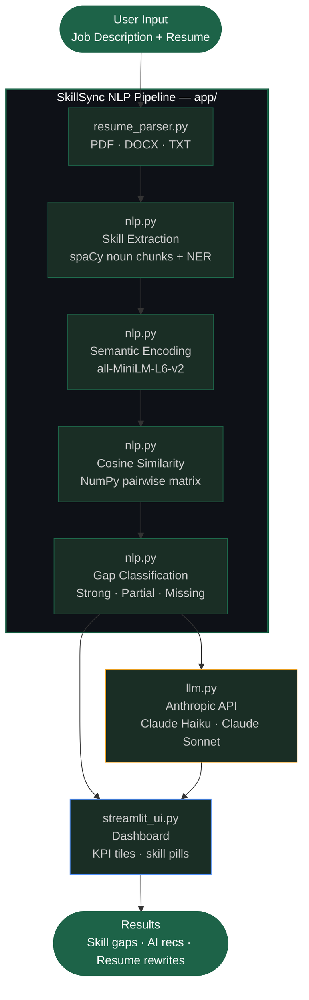

# SkillSync — Job Skills Gap Analyzer

> **GitHub Repository:** https://github.com/jjayytm/job-skills-gap-analyzer  
> **NLP Final Project · Cambrian College · Graduate Certificate in Artificial Intelligence · April 2026**

An **NLP capstone project** that semantically compares a job description to your resume and shows exactly where you stand — which skills are strong, partial, or missing — then delivers AI-powered recommendations and resume rewrite suggestions.


---

## Features

- **Paste any job description** — no scraping; paste the full posting with optional job title and company.
- **Resume upload** — PDF, DOCX, or TXT; text is extracted and used for skill matching.
- **Semantic skills gap** — skills are extracted (spaCy + curated list), then matched using **sentence-transformers** and cosine similarity. Each job skill is labelled:
  - **Strong match** — well covered on your resume
  - **Partial match** — related but could be strengthened
  - **Missing** — not clearly present
- **Adjustable thresholds** — tune the strong/partial similarity thresholds in the Advanced section before running analysis.
- **AI recommendations** — "Top skills to add or strengthen" with short, actionable hints (Claude Haiku).
- **AI resume rewrite suggestions** — copy-ready bullets and a gap summary aligned to the role (Claude Sonnet); never invents facts.
- **Dark, modern UI** — glassmorphism, skeleton loading, and smooth auto-scroll to results.

---

## Architecture



---

## Tech Stack

| Component | Technology |
|-----------|------------|
| UI | Streamlit |
| NLP / parsing | spaCy (`en_core_web_sm`) |
| Semantic similarity | sentence-transformers (`all-MiniLM-L6-v2`) |
| AI suggestions | Anthropic API (Claude Haiku for skill recs · Claude Sonnet for resume rewrites) |
| Resume parsing | PyPDF2, python-docx |
| Config | python-dotenv, `app/config.py` |

---

## Setup

### 1. Clone the repo

```bash
git clone https://github.com/jjayytm/job-skills-gap-analyzer.git
cd job-skills-gap-analyzer
```

### 2. Create a virtual environment

```bash
python -m venv .venv
# Windows
.venv\Scripts\activate
# macOS / Linux
source .venv/bin/activate
```

### 3. Install dependencies

```bash
pip install -r requirements.txt
```

### 4. Download the spaCy model

```bash
python -m spacy download en_core_web_sm
```

### 5. Set your Anthropic API key (required for AI features)

Copy the example env file:

```bash
cp .env.example .env
```

Edit `.env` and add your key:

```
ANTHROPIC_API_KEY=sk-ant-...
```

Get your key at [https://console.anthropic.com/](https://console.anthropic.com/).

Optional: set `ANTHROPIC_MODEL` to override the default model for skill recommendations.

Without `ANTHROPIC_API_KEY` the app still runs — skill matching and stats work fine, but the AI recommendation and resume rewrite sections will show an error until the key is set.

---

## Run the app

```bash
streamlit run app.py
```

Open the URL shown in the terminal (usually `http://localhost:8501`).

---

## How to use

1. **Step 01 — Job description**
   Paste the full job posting (and optionally job title + company). Click **Use this description**.

2. **Step 02 — Resume**
   Upload your resume (PDF, DOCX, or TXT). The app extracts the text automatically.

3. **Step 03 — Analyse**
   Optionally open **Advanced: adjust similarity thresholds** to tune the match sensitivity.
   Click **Analyse skills gap**. The page auto-scrolls to the results dashboard.

4. **Resume rewrite (optional)**
   Scroll to **AI resume rewrite suggestions**, click **Generate resume rewrite suggestions**, and wait for the skeleton loader. You'll get a gap summary and copy-ready bullets per role.

---

## Project structure

```
job-skills-gap-analyzer/
├── app.py                 # Entry point: streamlit run app.py
├── app/
│   ├── __init__.py
│   ├── config.py          # AppConfig — NLP thresholds and model names
│   ├── streamlit_ui.py    # Streamlit layout, steps, and widgets
│   ├── templates.py       # HTML snippets (hero, cards, pills)
│   ├── nlp.py             # Skill extraction, matching, summarize_gap
│   ├── llm.py             # Anthropic Claude — skill recommendations + resume rewrite
│   ├── resume_parser.py   # PDF / DOCX / TXT text extraction
│   └── models.py          # JobPosting dataclass
├── static/
│   └── styles.css         # Dark theme, glass cards, skeleton animations
├── requirements.txt
├── .env.example
├── NLP_OVERVIEW.md        # Detailed NLP pipeline description
└── README.md
```

---

## Configuration

- **Similarity thresholds** — Defaults are in `app/config.py` (`similarity_threshold_strong = 0.75`, `similarity_threshold_partial = 0.55`). Users can override them per-analysis via the Advanced section in the UI.
- **Anthropic** — API key loaded from `.env` or Streamlit secrets (`ANTHROPIC_API_KEY`). Optional `ANTHROPIC_MODEL` overrides the skill-recommendation model. Defaults and token limits are set in `app/llm.py`.

---

## Deployment (Streamlit Community Cloud)

1. Push the repo to GitHub.
2. In [Streamlit Community Cloud](https://share.streamlit.io), create a new app pointing to this repo.
3. Set **Main file path** to `app.py`.
4. Add **Secrets**: `ANTHROPIC_API_KEY = "sk-ant-..."` (and optionally `ANTHROPIC_MODEL`).
5. Deploy.

---

## Acknowledgments

- **spaCy** — NLP tokenization and entity recognition
- **sentence-transformers** — Semantic embeddings (`all-MiniLM-L6-v2`)
- **Streamlit** — Web UI framework
- **Anthropic** — Claude Haiku / Claude Sonnet for skill and resume suggestion features

Built as an NLP capstone / career-readiness project.
